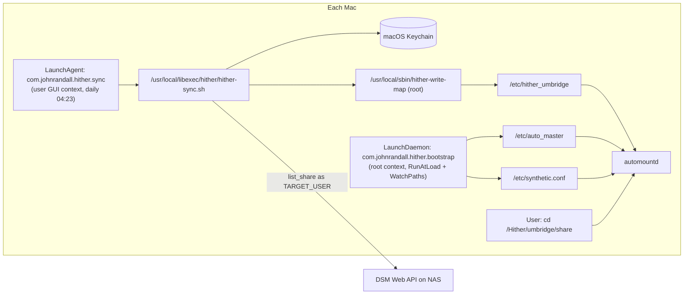

# Hither

**Bring it here. A lazy mounter for personal Mac fleets.**

Hither manages autofs maps so that remote SMB shares appear at predictable, stable paths under `/Hither/{host}/{share}` on every Mac in the fleet, with a LaunchDaemon that defends the system configuration against macOS update reverts.

## What this is

Apple's autofs is great when it works and miserable when it doesn't. macOS system updates routinely wipe `/etc/auto_master`, which silently breaks every indirect map on the machine until somebody notices that `cd /Network/foo` no longer triggers a mount. The historical workaround — a `sudoers` grant for `tee /etc/auto_smb_*` — turned out to be path-traversable (the `*` wildcard in a sudo argument matches `/`), making the convenience a security hole. And the `/Network` filesystem path conceptually collides with Finder's "Network" sidebar item, which is actually a Bonjour browser — confusing users who don't realize they're looking at two different things wearing the same name.

Hither addresses all three problems. It mounts under `/Hither/` instead of `/Network/`, sidestepping the Finder naming clash and matching macOS's CamelCase root convention (`/Applications`, `/Library`, `/Volumes`). It uses a root-owned wrapper script with a strict `^[a-z0-9-]+$` host-name whitelist instead of a sudoers wildcard, closing the path-traversal hole. And it ships a LaunchDaemon that watches `/etc/auto_master` and `/etc/synthetic.conf`, re-applying Hither's lines whenever an OS update reverts them.

There is no Hither server — Hither is a per-Mac tool. A LaunchAgent on each Mac fires daily (04:23 local), enumerates the user's SMB-readable shares via the DSM Web API, renders an autofs indirect-map body, and writes it through a root-owned wrapper. The DSM password is read from the macOS Keychain — the same entry Finder uses for SMB mounts — so there is no separate credential store, no external secret manager, no orchestrator. On the client side, autofs handles everything else: shares mount on access, unmount on idle, and the user never sees the wiring.

## Architecture



Two daemons, clean separation, no external orchestration:

| Daemon | Context | Role | Network? |
|---|---|---|---|
| `com.johnrandall.hither.bootstrap` | LaunchDaemon (root) | Re-apply `/etc/synthetic.conf` + `/etc/auto_master` on revert | never — runs before Tailscale/Wi-Fi |
| `com.johnrandall.hither.sync` | LaunchAgent (user) | Daily DSM API call → render map → write via `hither-write-map` | yes |

The LaunchAgent runs in user GUI context, which has Keychain access. The DSM password lives in the macOS Keychain (`security add-internet-password -s <nas> -a <user>`). No 1Password dependency, no xyOps dependency, no external orchestrator.

## Install

Hither is private through v0.4 — no Homebrew tap yet. Install from a local clone:

```bash
git clone <forgejo-umbridge:dev/hither.git> ~/dev/hither
cd ~/dev/hither
lash install

# Root phase — installs to /etc, /usr/local, /Library/LaunchDaemons
sudo "$(which hither)" bootstrap

# User phase — installs ~/Library/LaunchAgents/com.johnrandall.hither.sync.plist
hither bootstrap --user-only

# One-time Keychain prime (skip if Finder Cmd-K already saved it)
security add-internet-password -s umbridge -a johntrandall -r 'smb ' -w
```

The root phase performs five steps:

1. Adds the `Hither` synthetic-root symlink entry to `/etc/synthetic.conf` and materializes `/Hither` (via `apfs.util -t`).
2. Applies the initial `/etc/auto_master` entries for each subscribed host (currently: `umbridge`).
3. Installs the root-owned wrapper `sbin/hither-write-map` to `/usr/local/sbin/hither-write-map`.
4. Installs the bootstrap scripts and `hither-sync.sh` to `/usr/local/libexec/hither/`.
5. Installs and loads the LaunchDaemon at `/Library/LaunchDaemons/com.johnrandall.hither.bootstrap.plist`.

The user phase installs `~/Library/LaunchAgents/com.johnrandall.hither.sync.plist` (with `__HOME__` substituted at install time) and bootstraps it into the user's `gui/<uid>` launchd domain.

`bootstrap --reapply-only` (root phase only) skips steps 3-5. It is what the boot-time LaunchDaemon runs at WatchPaths trigger — file repair only.

### Manual fire

```bash
hither sync    # exec /usr/local/libexec/hither/hither-sync.sh in user shell
```

Same effect as `launchctl kickstart gui/$(id -u)/com.johnrandall.hither.sync`. Refuses to run as root (Keychain access requires user GUI session). Override the DSM password out-of-band via env var:

```bash
UMBRIDGE_DSM_PASSWORD=$(op read 'op://<vault>/<item>/password') hither sync
```

## Verify

```bash
hither doctor
hither verify-no-leaks
```

`doctor` reports the state of the three pieces of system configuration (synthetic root, auto_master entries, hither_* map files) and confirms the LaunchDaemon is loaded. `verify-no-leaks` checks that no live share-path or PII data has been committed back into the repo.

## Sub-projects

| Document | Purpose |
|---|---|
| [docs/architecture.md](docs/architecture.md) | Detailed architecture: both daemons, data flow |
| [docs/design-decisions.md](docs/design-decisions.md) | Why this design — the alternatives considered and rejected |
| [docs/glossary.md](docs/glossary.md) | Terms (autofs, lash, etc.) for non-John readers |
| [docs/roadmap.md](docs/roadmap.md) | Internal planning: v0.2 → v1.0 distribution-readiness work |

The architectural rationale for adopting Hither across the fleet — and superseding the prior `auto_smb_*` sudoers scheme — lives in `admin-technical/ADRs/ADR-NNN-Hither-Lazy-Mounter.md` (TBD).

## File layout

```
hither/
├── README.md                    # this file
├── docs/
│   ├── architecture.md          # detailed architecture
│   ├── design-decisions.md      # rationale
│   ├── glossary.md              # terms for non-John readers
│   └── roadmap.md               # internal planning (v0.2 → v1.0)
├── bin/
│   └── hither                   # CLI (bootstrap, sync, doctor, verify-no-leaks, version)
├── sbin/
│   └── hither-write-map         # root-owned wrapper, installed at /usr/local/sbin/
├── libexec/
│   └── hither-sync.sh           # daily share enumeration; installed at /usr/local/libexec/hither/
├── bootstrap/
│   ├── add-synthetic-root.sh    # installs to /usr/local/libexec/hither/; appends "Hither<TAB>System/Volumes/Data/Hither" to /etc/synthetic.conf
│   ├── apply-auto-master.sh     # installs to /usr/local/libexec/hither/; appends /Hither/{host} lines to /etc/auto_master
│   └── install-launchdaemon.sh  # installs the plist to /Library/LaunchDaemons/
├── launchd/
│   ├── com.johnrandall.hither.bootstrap.plist   # LaunchDaemon — revert defender
│   └── com.johnrandall.hither.sync.plist        # LaunchAgent — daily sync (template, __HOME__ substituted at install)
├── server/                      # vestigial — xyOps registration (deleted in Phase 4, post burn-in)
│   ├── hither-sync.manifest.json
│   ├── register-events.sh
│   └── sudoers/xysat-hither-sync
├── scripts/
│   ├── doctor.sh
│   └── verify-no-leaks.sh
├── completions/
│   ├── hither.bash
│   └── _hither
└── lash.json                    # lash install manifest
```
