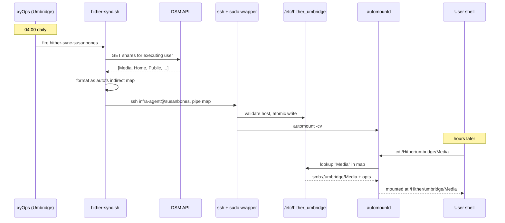

# Architecture

Hither is a two-sided system: a server-side job that enumerates available shares and pushes autofs maps, and a client-side configuration that makes those maps appear at stable paths on each Mac.

## Server side (Umbridge — Synology NAS)

The server side runs as a single shell script (`server/hither-sync.sh`) scheduled by xyOps.

| Component | Detail |
|---|---|
| Scheduler | xyOps event `hither-sync-{host}`, daily at 04:00 |
| Runner | `server/hither-sync.sh` |
| Identity | Runs under the xysat satellite on Umbridge |
| Source of truth | DSM API — enumerates SMB-accessible shares |
| Delivery | SSH to each subscriber Mac, pipes map body to `sudo -n /usr/local/sbin/hither-write-map {host}` |

The sync flow:

1. The xyOps event fires at 04:00.
2. `hither-sync.sh` calls the DSM Web API and gets the list of shares the executing user can see over SMB.
3. The script formats that list as an autofs indirect-map body — one line per share, with the appropriate SMB URL and mount options.
4. For each subscriber Mac in the manifest, the script SSHes in as `infra-agent` and pipes the map body into the wrapper: `cat map.body | ssh infra-agent@mac "sudo -n /usr/local/sbin/hither-write-map umbridge"`.
5. The wrapper validates the hostname argument, writes `/etc/hither_umbridge` atomically, and runs `automount -cv` to pick up the change.

Subscribers are listed in `server/hither-sync.manifest.json` and the SSH grant is constrained by `server/sudoers/xysat-hither-sync` on the Synology side.

## Client side (each Mac)

Three pieces of system state on the Mac, each managed by a different bootstrap step:

| State | Path | Source | Frequency |
|---|---|---|---|
| Synthetic root | `/etc/synthetic.conf` line: `Hither` | `bootstrap/add-synthetic-root.sh` | One-shot; re-applied by daemon on revert |
| Autofs mountpoints | `/etc/auto_master` lines: `/Hither/{host}\thither_{host}\t-nosuid` | `bootstrap/apply-auto-master.sh` | One-shot per subscribed host; re-applied by daemon on revert |
| Autofs maps | `/etc/hither_{host}` | Server (via wrapper) | Daily, regenerated on every sync |

The first two pieces are structural — once set up, they only change when subscribing to a new host or recovering from a macOS update revert. The third piece is data — regenerated daily by the server.

## LaunchDaemon

`/Library/LaunchDaemons/com.johnrandall.hither.bootstrap.plist` runs at boot and on file-system trigger:

- **RunAtLoad**: re-applies synthetic.conf and auto_master at every boot.
- **WatchPaths**: monitors `/etc/auto_master` and `/etc/synthetic.conf` for modification. If macOS updates strip Hither's lines, the daemon re-adds them.

The daemon NEVER does network calls (it must run before Tailscale is up at boot) and NEVER stats anything under `/Hither/{host}/`. See [design-decisions.md](design-decisions.md) for why these constraints are load-bearing.

## Wrapper

`/usr/local/sbin/hither-write-map` is the only piece of Hither that runs as root in normal operation. It is installed from `sbin/hither-write-map` in this repo.

Its job is exactly this:

1. Validate `argv[1]` against `^[a-z0-9-]+$`. Reject anything else.
2. Read map body from stdin into a tempfile in `/etc/`.
3. `mv` the tempfile to `/etc/hither_{host}` (atomic rename within the same filesystem).
4. Run `automount -cv` to flush the autofs cache.

The hostname whitelist is the security boundary. The original sudoers grant — `infra-agent ALL=(root) NOPASSWD: /usr/bin/tee /etc/auto_smb_*` — was path-traversable because `*` in a sudo argument position matches `/`, allowing arbitrary file writes. The wrapper closes that hole.

## Data flow

The data flow is **one-way**: repo → Mac `/etc/`, never Mac `/etc/` → repo. The live `/etc/hither_{host}` files contain actual share names which may include family/PII data; they are never committed. The repo holds structure (bootstrap scripts, wrapper, LaunchDaemon, the sync job source). The live state holds data.
